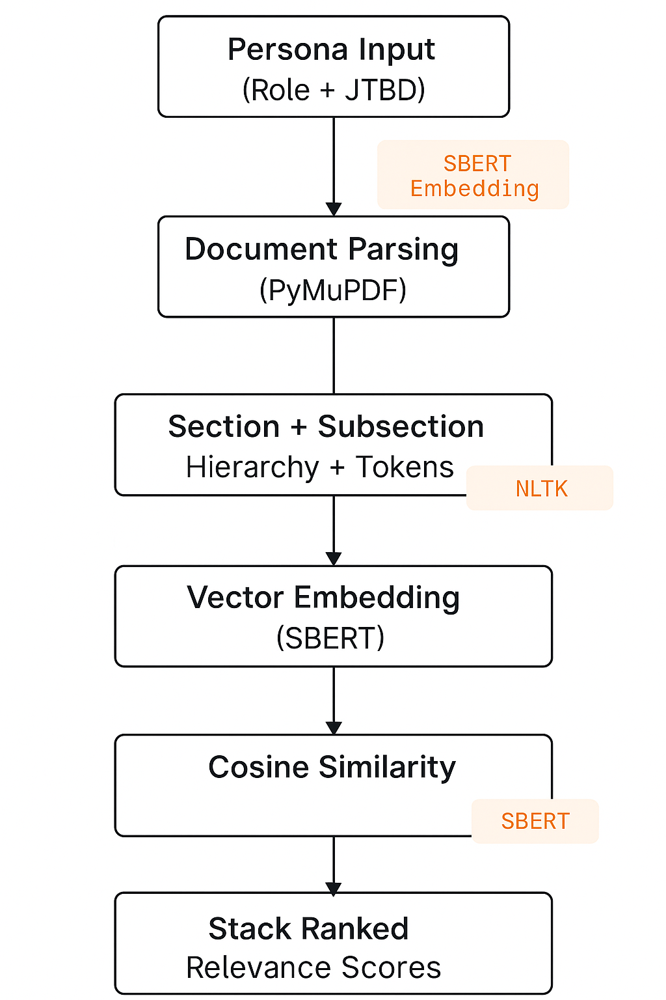

# Approach Explanation – Persona-Driven Document Analyst 

##  Problem Understanding

In today’s information-rich landscape, users often drown in documents. Adobe's challenge emphasized **extracting only the most relevant sections** of large documents based on a **specific persona and their job-to-be-done (JTBD)**. This project treats each persona as a dynamic information lens — allowing a document to be interpreted differently depending on who is reading and what they seek to achieve.

##  Methodology Overview

Our solution combines **semantic understanding**, **language modeling**, and **domain-aware document parsing** to emulate how an expert would skim through PDFs with intent.

### 1.  Document Parsing

Using `PyMuPDF`, we extract text page-wise while preserving the structure and layout metadata (font size, heading hierarchy, and positional clues). This forms a hierarchical document outline — sections and subsections — essential for downstream relevance scoring.

### 2.  Persona & JTBD Encoding

The persona definition (e.g., *Innovation Manager seeking Generative AI applications*) is processed into a dense vector using `sentence-transformers` (SBERT). This vector acts as an **information query** during similarity ranking.

### 3.  Semantic Matching & Relevance Ranking

Each document section and subsection is vectorized using the same SBERT encoder. Cosine similarity is then computed between each section and the persona query. Sections are **stack ranked** based on this semantic closeness.

We use a hybrid scoring approach:
- **Section-Level Matching** — broader relevance
- **Subsection-Level Matching** — finer granularity
- Combined with heading-level weighting

### 4.  Prioritization Logic

To surface not just relevant, but *most actionable* insights:
- Repetitive, boilerplate, or index-heavy content is deprioritized
- NLP techniques (`nltk`, `spacy`) help detect noise or low-value patterns
- Rank normalization ensures consistent scoring across documents

## 🔄 System Architecture

Below is a high-level flowchart of the system:

##  Containerized Delivery

The solution is packaged via **Docker**, ensuring reproducibility and ease of testing. Sample input/output folders are mapped via volume mounts. The tool can run locally or be deployed on any cloud platform.

##  Future Extensions

- Multi-persona support with weighting
- Interactive persona tuning via prompt injection (chat-style)
- Visual attention heatmaps over documents

##  Why It Stands Out

This is more than text extraction — it's **contextual understanding**. Our approach doesn’t just read PDFs — it reads **for someone with a goal**. The system understands intent and **prioritizes content as an expert analyst would**.

With scalable architecture and modular design, this solution is ready to extend into Adobe’s suite of intelligent document experiences.

---

 Authors: Shubham Srivastava
